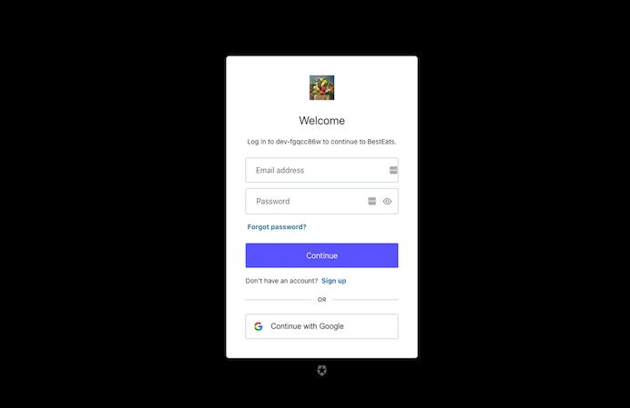

<!-- PROJECT LOGO -->
 

  

# Best Eats

### Contributors
**Full-Stack Developers:**
<a href="https://github.com/afong888">Alan Fong</a>,
<a href="https://github.com/jleiandy">Andy Lei</a>,
<a href="https://github.com/FikriAnuar">Fikri Anuar</a>,
<a href="https://github.com/jshzglr">Josh Zigler</a>,
<a href="https://github.com/chiakat">Katherine Yu</a>,
<a href="https://github.com/sparangan">Savanna Parangan</a>,
<a href="https://github.com/theGuyNextDoor">Tim Jordan</a>

**Architecture Owner:**
<a href="https://github.com/afong888">Alan Fong</a>

**UI Owner:**
<a href="https://github.com/chiakat">Katherine Yu</a>

**Product Manager:**
<a href="https://github.com/sparangan">Savanna Parangan</a>
 

<!-- ABOUT THE PROJECT -->
## About The Project
 

  

This project was a brief 1-week sprint where our team completed an MVP for Best Eats, a one-stop grocery shop for working adults and young families. This website is designed to assist those with little to no time to shop for groceries find a quick alternative while maintaining a healthy lifestyle. Aside from grocery shopping, this website offers meal plans, nutrition tracking, avenue to local farmers, and more.

(<a href="#top">back to top</a>)

## App Features

<table>
    <tr>
      <td>
        
      </td>
      <td>
        <b>User authentication:</b> Users must sign up and be authenticated to subscribe to meal plans, purchase groceries, and access user profiles where they can keeping track of how they feel on a daily-basis. Users are authenticated through Auth0.
      </td>
    </tr>
    <tr>
      <td>
        
    </td>
    <td>
      <b>Subscription:</b> Users can select from various weekly meal plan subscription options and submit their shipping and billing information to complete the checkout process. Subscribed members unlock access to the meal plans.
    </td>
  </tr>
  <tr>
  <td>
    
    <td>
      <b>Meal Plan:</b>  Users are able to see the various meals offered by Best Eats. Meals can be filtered by ingredients and/or dietary restrictions and choices. Users must be subscribed in order to select meals. Subscribed users can select the meals they want and order all ingredients for their respective meals in just one click.
    </td>
  </td>
  <td>
  </tr>
  <tr>
  <td>
    
    <td>
      <b>Grocery Store:</b>  The store displays grocery items availabe for purchase. The items available will be what local farmers are able to provide. This store is separate from other grocery chains and is the main feature that facilitates interaction between farmers and users.
    </td>
    </tr>
  

  <tr>
    <td>
      
    </td>
    <td>
      <b>Meet the Farmers:</b>  The meet the farmers feature displays pictures, bios and contact info for the farmers within the client’s network. Users can come here to learn more about and connect with those who grow their produce.
    </td>
  </tr>
  <tr>
    <td>
      
    </td>
    <td>
      <b>Lifestyle Guide:</b> Users can find resources to nutritionists who can provide expertise on a meal plan that is right for them. In addition, with an account, users can identify goals and track their day-to-day progress.
    </td>
  </tr>
  <tr>
    <td>
      
    </td>
    <td>
      <b>User Profile:</b>  Users can keep track of their past orders, see their upcoming meals and see recommended meals for future weeks. They can also view the nutrition information for all meals they have ordered for the week and post to a journal to reflect on their well-being over time.
      </td>
  </tr >
</table>

(<a href="#top">back to top</a>)

### Built With

* [React.js](https://reactjs.org/)
* [Express.js](https://expressjs.com/)
* [MUI](https://mui.com/)
* [PostgreSQL](https://www.postgresql.org/)
* [Auth0](https://auth0.com/)

(<a href="#top">back to top</a>)

## Getting Started
First install dependencies:
npm install

To create a development build:
npm run react-dev

To start server:
npm run start

(<a href="#top">back to top</a>)

